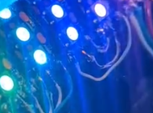
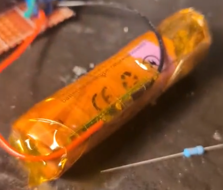
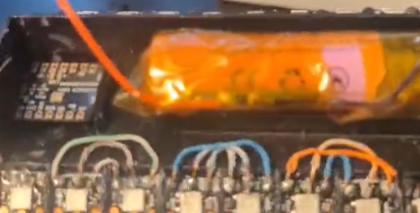
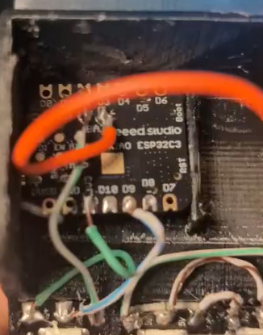
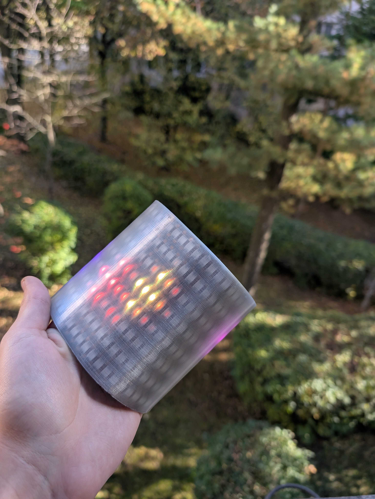

# Instructions

## Parts

- Filament
- 2m of 144/m ws2812 led strip
- 18650 battery
- bms for the 18650
- some wire
- xiao esp32-c3

## Assembly

1. Cut up the strip into 8 pieces, and glue them in the channels of the 3d print

    
2. Wire up the strips with small wires

    
    
3. connect the bms to the 18650 and use capton tape to insulate it
   
   
4. Put everything in the case

    

5. Solder up the xiao based on the wiring diagram

    

6. Snap on the diffusor

    

## Diagram

